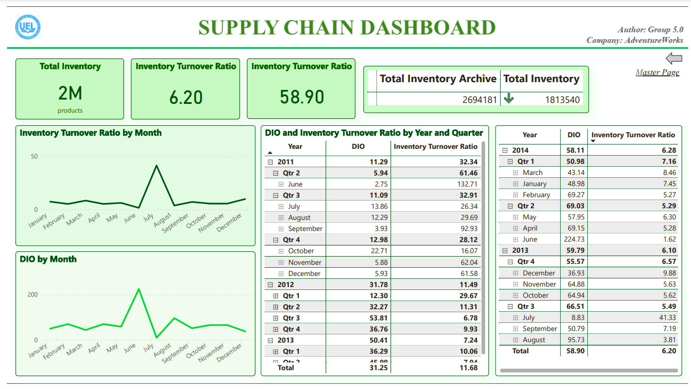

# Cloud-Based Business Intelligence Solution for Supply Chain Management

## Introduction

This project, undertaken by Group 5.0 from the University of Economics and Law, focuses on developing a cloud-based Business Intelligence (BI) solution to enhance the supply chain management of Adventure Works Cycles (AWC). Our aim is to integrate data from various departments to provide actionable insights and support informed decision-making.

## Team Members
- Lý Vũ Thiên Ân (K214161372)
- Hoàng Thị Nhật Quyên (K214162151)
- Trần Thị Ý Như (K214162149)
- Lê Tuấn Nguyên (K214160993)

## Data Engineering

Our data engineering efforts encompassed the following:

1. **Data Source Layer:** 
   - We utilized the AdventureWorks 2019 database as our primary data source, hosted on Azure SQL Server.

2. **Data Ingestion Layer:** 
   - We employed Azure Data Factory to extract data from the AdventureWorks2019 database. This data was then ingested into Azure Data Lake Storage Gen2, stored as parquet files.

3. **Data Storage Layer:** 
   - The data was organized into three tiers within Azure Data Lake Storage Gen2:
     - **Bronze:** Raw data
     - **Silver:** Pre-processed data
     - **Gold:** Enriched and refined data ready for analytics

4. **Data Process Layer:** 
   - The processed data in the Gold layer was loaded into Azure Synapse Serverless SQL Pool 

5. **Consumption Layer:** 
   - Data from  Azure Synapse Serverless SQL Pool is integrated into Power BI for detailed analysis and visualization.
   - We built a data model consisting of Fact, Dimension, and Bridge tables to facilitate efficient data analysis.

## Dashboards Built

We developed an interactive Power BI dashboard to provide comprehensive insights into AWC's supply chain performance, integrating data from various sources to drive informed decision-making. The dashboard is organized into key areas:

### Master Page

This will be the home page of the report, on this page the research team will provide options for viewers. Each selection will correspond to a dashboard (labeled corresponding to the caption name of each button). In total, this page will display 6 buttons corresponding to the remaining 6 components of the report.

### Overview

This page provides an overview of key activities and components in the supply chain. The layout is decomposed into small components such as product supply system, suppliers, supplied products, inventory. Some of the big-picture metrics used in this dashboard include number of orders, average shipping cost, total shipping cost, and average delivery time and order rate metrics. delivery early or on time. Data displayed on the dashboard will be filtered by year.

### Shipping KPIs

This page is a dashboard that displays key shipping-related performance metrics such as average shipping time, Total orders, Average shipping cost per product, and Total shipping cost by month.

### Delivery KPIs

This page is a dashboard that shows key performance metrics related to delivery such as average lead time, average delivery date, early and on-time order rate, and order rejection rate. The charts show order quantity by shipping method and supplier distribution. With a map showing the distribution of suppliers and a matrix showing indicators by location

### Inventory KPIs

For this page, the dashboard will show key performance indicators related to inventory management such as Total Inventory, DIO (Days Inventory Outstanding), and Inventory Turnover Rate by year and quarter. The chart displays the inventory turnover rate and DIO by month, along with a matrix representing two indicators classified from year to quarter and finally to month.

### Historical Transaction Cost

This page will display a Zebra BI chart analyzing actual costs by product between the periods Quarter 3/2012 - Quarter 2/2013 and Quarter 3/2013 - Quarter 2/2014. The chart shows cost variation by product type and product subcategory.

### Manage Product Inventory

This page will be a dashboard to manage product inventory at different locations. In addition, the Total Work Order Qty, Days Inventory Outstanding and Inventory Turnover Ratio buttons will display a matrix corresponding to the labeled values according to the products. The chart displays the total number of products by different storage areas, classified from location - shelf - bin, and the total number of orders by month

## Conclusion

By implementing this BI solution, AdventureWorks can gain a comprehensive understanding of its supply chain operations, identify areas for improvement, and make data-driven decisions to optimize processes, reduce costs, and enhance overall efficiency.
